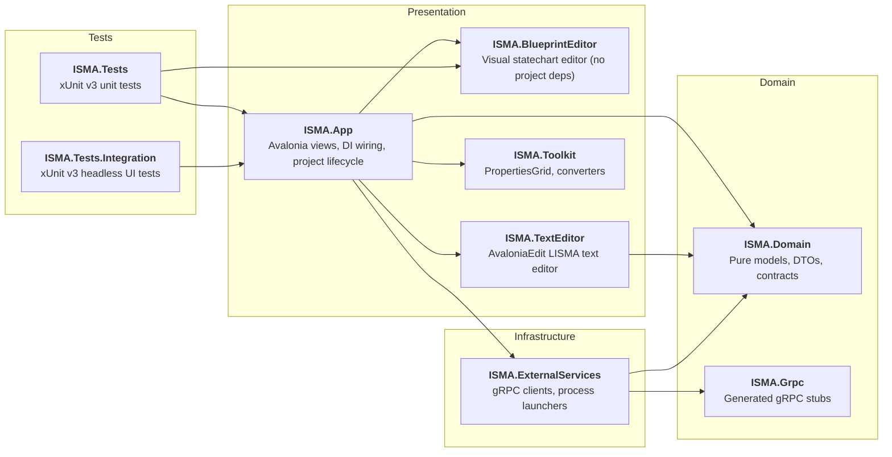

# ISMA UI — Agent Instructions

## Commands

```bash
dotnet build isma-ui-dotnet.slnx
dotnet run --project src/ISMA.App
dotnet test
```

No `cd` required — the solution file is at the repo root.

## Architecture

Layered Clean Architecture, dependency direction is strict:



## Framework specifics

- **Avalonia 12.0.3** — `AvaloniaUseCompiledBindingsByDefault` is enabled globally in `Directory.Build.props`. All views use `x:DataType`.
- **CommunityToolkit.Mvvm** — `[ObservableProperty]`, `[RelayCommand]`, source generators. No reactive frameworks.
- **DI** — `Microsoft.Extensions.DependencyInjection`. App layer registers everything in `ServiceCollectionExtensions.cs`. Tests use `ConfigureAppServices()` and override specific services (e.g. `ISimulationServerFacade`) before calling it.
- **Server communication** — gRPC over Unix Domain Sockets
- **No XAML code-behind logic** — Views contain only markup. All logic is in ViewModels or services.

## Testing

Two test projects with different scopes:

**Unit tests** (`tests/ISMA.Tests`): Domain models, app view models, and blueprint editor view models/utilities. Uses Moq for interfaces.

**Integration tests** (`tests/ISMA.Tests.Integration`): Headless Avalonia UI tests.
- Integration tests checks end-to-end flows with Avalonia Headless Platform
- Integration tests mock only external dependecises
- Intergation tests always interact with Avalonia UI components (View layer)
- Using View Models for UI interactions in tests is prohibited

## Package management

Centralized via `Directory.Packages.props` at both root and `src/` level. All versions pinned in one place. Never edit a `.csproj` to change a version.

## Code Rules

### C#
- Prefer primary constructors
- Prefer records for data models
- Prefer `init` instead of `set` in auto-properties
- Add XML documentation comments for 
  - public interfaces
  - data models
- Avoid using reflection
- Write code as strict as possible
- Put each top-level class into a separate file

### Avalonia
- Stricly follow MVVM pattern
- **No XAML code-behind logic** — Views contain only markup. All logic is in ViewModels or services.

| File | Role |
|---|---|
| `src/ISMA.App/Program.cs` | Entry point — `BuildAvaloniaApp()` |
| `src/ISMA.App/App.axaml.cs` | DI initialization, server path resolution, MainWindow creation |
| `src/ISMA.App/ServiceCollectionExtensions.cs` | Shared DI config for app + integration tests |
| `src/ISMA.App/Styles/GlobalStyles.axaml` | Global theme: colors, fonts, control styles |
| `src/ISMA.App/MainWindow.axaml` | Main window: menu, toolbar, editor tabs, settings, error list, process bar |
| `src/ISMA.App/Services/ProjectService.cs` | Multi-project lifecycle (open, save, close, tabs) |
| `src/ISMA.App/Services/ProjectFileService.cs` | File pickers (open/save/save-as) and `.im2`/`.iscm2` routing |
| `src/ISMA.App/Services/Blueprint/BlueprintFileSerializer.cs` | `.iscm2` JSON (de)serialization of `BlueprintModel` |
| `src/ISMA.BlueprintEditor/Views/IsmaBlueprintEditor.axaml` | Blueprint editor: toolbar, canvas, state/loop editor tabs |
| `src/ISMA.BlueprintEditor/ViewModels/IsmaBlueprintViewModel.cs` | Editor state machine (modes, states, transactions) |
| `src/ISMA.TextEditor/IsmaTextEditor.cs` | LISMA text editor control (AvaloniaEdit) |
| `run.sh` | Convenience script — auto-detects script dir for `appsettings.json` |

## Docs

Feature documentation lives in `docs/features/`. Start at `docs/features/README.md`.
Use cases documentation lives in `docs/use-cases/`. Start at `docs/use-cases/README.md`.
