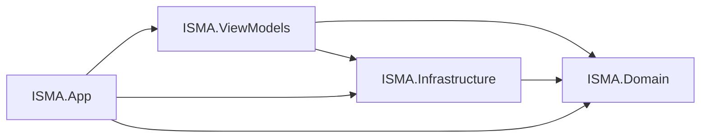
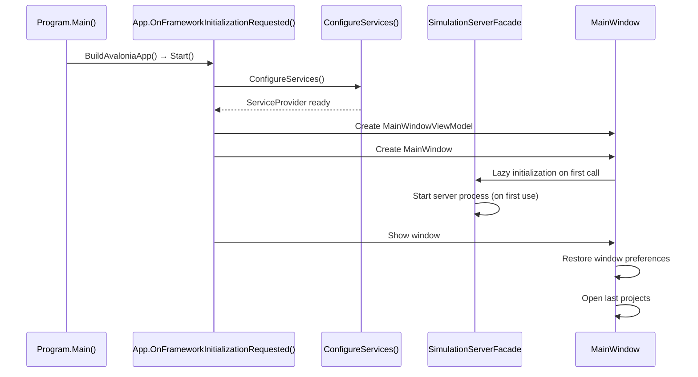

# ISMA UI Avalonia — Architecture Overview

## Purpose

ISMA UI Avalonia is a multi-assembly C# desktop application that provides editing, simulation, and visualization capabilities for the ISMA mathematical modeling environment. It follows a layered architecture: domain models (pure C#) → infrastructure services (gRPC/HTTP clients) → ViewModels (MVVM business logic) → app layer (Avalonia views) with `IServiceCollection` dependency injection wiring the layers together.

## Assembly Structure

```
isma-ui-avalonia-2/src/
├── ISMA.Domain/                         # Pure C# domain models, DTOs, contracts
│   ├── Models/                          # Blueprint, Simulation, Error, Preferences models
│   ├── Dtos/                            # Server DTOs (SyntaxTokenDto, CompilationErrorDto, etc.)
│   ├── Contracts/                       # Service interfaces (ISimulationServerFacade, etc.)
│   └── Conversion/                      # BlueprintToLismaConverter, ResultSimplifier
├── ISMA.ViewModels/                    # MVVM ViewModels, converters, VM services
│   ├── ViewModels/                      # All ViewModels (MainWindow, Project, Simulation, etc.)
│   ├── Services/                        # VM-level services (LismaPdeService, etc.)
│   ├── Converters/                      # BoolToVisibility, ModeToVisibility, etc.
│   └── Models/                          # VM-specific models (SimulationParameters, etc.)
├── ISMA.Infrastructure/                 # Server communication, file storage, chart viewer
│   ├── Server/                          # gRPC/HTTP clients, server manager, facade
│   ├── ChartViewer/                     # GrinProcessLauncher
│   └── FileStorage/                     # PreferencesProvider, JSON serialization
└── ISMA.App/                            # UI views, controls, app entry point, DI
    ├── Views/                           # All Avalonia AXAML views
    ├── Controls/                        # Custom controls (PropertiesGrid, ArrowLine, LoopArrow)
    ├── Services/                        # App-layer services (ProjectFileService, etc.)
    ├── Styles/                          # GlobalStyles.axaml (theme, colors, fonts)
    └── Automation/                      # AutomationIds for testing
```

## Dependency Graph



The `ISMA.App` assembly depends on all other assemblies. `ISMA.ViewModels` depends on `ISMA.Domain` and `ISMA.Infrastructure`. The `ISMA.Domain` assembly is the leaf — pure C# with no UI or framework dependencies.

## Design Principles

### Separation of Concerns

- **Domain layer** — No UI or framework dependencies. Pure C# data classes and interfaces for simulation results, progress, blueprints, and metadata.
- **Infrastructure** — No Avalonia. gRPC stubs, HTTP client, server process management, file storage, and chart launching are all plain C#.
- **ViewModels** — No Avalonia. All MVVM ViewModels use `CommunityToolkit.Mvvm` source-generated attributes (`[ObservableProperty]`, `[RelayCommand]`). Views bind to ViewModel properties and commands.
- **App layer** — Wires everything together. Avalonia views observe ViewModels; ViewModels consume infrastructure services and domain models.

### CommunityToolkit.Mvvm

All ViewModels use CommunityToolkit.Mvvm for MVVM boilerplate elimination. There are no manual `INotifyPropertyChanged` implementations. The source generator produces property change notification code from `[ObservableProperty]`, `[RelayCommand]`, and `[ObservableObject]` attributes.

```csharp
[ObservableObject]
public partial class MainWindowViewModel
{
    [ObservableProperty] private IProjectViewModel? _activeProject;
    [ObservableProperty] private ObservableCollection<IProjectViewModel> _projects = new();

    [RelayCommand]
    private async Task NewTextAsync() { ... }
}
```

### Dependency Injection

All services and ViewModels are instantiated through `Microsoft.Extensions.DependencyInjection`. The DI hierarchy follows assembly boundaries:

```
ISMA.Domain (contracts/interfaces)
    → ISMA.Infrastructure (implementations)
    → ISMA.ViewModels (ViewModels + VM services)
    → ISMA.App (views + app services)
```

`IServiceCollection` is configured in `App.axaml.cs::ConfigureServiceCollection()`. All registrations use `AddSingleton()` or `AddTransient()` as appropriate.

### Async/Await Concurrency

All long-running operations (simulation monitoring, file I/O, server communication) use `async/await`. The UI thread is never blocked. Progress updates from gRPC streams are marshalled to the ViewModel via `ObservableCollection` additions on the UI thread.

### Observable Collections

UI state is managed through `ObservableCollection<T>` and `ObservableCollection`-equivalent collections. ViewModels expose collections that Avalonia views bind to via `Binding` in AXAML. Changes to collections (add/remove) automatically update the UI.

## Application Startup Flow



## Key Interfaces

### IProjectViewModel

Defined in `ISMA.ViewModels/ViewModels/IProjectViewModel.cs`:

```csharp
public interface IProjectViewModel
{
    string Name { get; set; }
    string? FilePath { get; set; }
    string EditorContent { get; set; }
    bool IsDirty { get; }
    void Cut();
    void Copy();
    void Paste();
    void SetContent(string content);
}
```

Two implementations exist:
- `LismaProjectViewModel` — text-based LISMA projects, backed by AvaloniaEdit `TextEditor`
- `BlueprintProjectViewModel` — visual statechart projects, backed by `BlueprintEditorViewModel`

### SimulationServiceViewModel

Orchestrates the full simulation lifecycle:

```csharp
[ObservableObject]
public partial class SimulationServiceViewModel : ISimulationServiceViewModel
{
    [ObservableProperty] private ObservableCollection<InProgressSimulationViewModel> _inProgressSimulations = new();
    [ObservableProperty] private ObservableCollection<CompletedSimulationViewModel> _completedSimulations = new();

    [RelayCommand]
    private async Task SimulateAsync() { ... }

    [RelayCommand]
    private async Task VerifyAsync() { ... }
}
```

**Flow:**
1. Snapshot simulation parameters and project source
2. Compile model via `SimulationServerFacade.CompileModel()`
3. Report compilation errors to `ErrorListViewModel`
4. Run simulation via `SimulationServerFacade.RunSimulation()`
5. Monitor progress via `SimulationServerFacade.MonitorSimulation()` → yield stream → update progress
6. Download result via `SimulationServerFacade.DownloadResult()`
7. Create `CompletedSimulation` and add to `CompletedSimulations` collection

## DI Configuration

**File:** `ISMA.App/App.axaml.cs::ConfigureServiceCollection()`

```csharp
services
    // Domain contracts
    .AddSingleton<ISimulationServerFacade, SimulationServerFacade>()
    .AddSingleton<ISyntaxHighlighter, SyntaxHighlighterService>()
    .AddSingleton<IProjectService, ProjectService>()
    .AddSingleton<IProjectFileService, ProjectFileService>()
    .AddSingleton<IErrorListViewModel, ErrorListViewModel>()
    .AddSingleton<ISimulationServiceViewModel, SimulationServiceViewModel>()
    .AddSingleton<ISimulationResultService, SimulationResultService>()
    .AddSingleton<ISimulationParametersStoreService, SimulationParametersService>()
    .AddSingleton<IPreferencesProvider, PreferencesProvider>()
    .AddSingleton<IDialogService, DialogService>()
    .AddSingleton<IEditorPlatformService, EditorPlatformService>()
    // ViewModels
    .AddSingleton<MainWindowViewModel>()
    // Views
    .AddSingleton<MainWindow>();
```

All registrations use `AddSingleton()` (singleton) lifecycle. Views are resolved on-demand by the Avalonia `ViewLocator`.

## Key Differences from JavaFX/Kotlin Original

| Aspect | JavaFX Original | Avalonia Port |
|--------|----------------|---------------|
| UI Framework | JavaFX + TornadoFX | AvaloniaUI + CommunityToolkit.Mvvm |
| DI | Koin | Microsoft.Extensions.DependencyInjection |
| Concurrency | Kotlin Coroutines | C# async/await + Task |
| Observable Collections | JavaFX ObservableList | .NET ObservableCollection<T> |
| Property Binding | TornadoFX bind() | AXAML Binding + CommunityToolkit source generation |
| Rich Text Editor | fxmisc.richtext | AvaloniaEdit (ICSharpCode.AvaloniaEdit) |
| Serialization | kotlinx.serialization | System.Text.Json |
| gRPC | gRPC-Netty with Epoll | Grpc.Net.Client with Unix socket handler |
| HTTP Client | Ktor CIO | HttpClient with Unix socket handler |
| Icon Library | Ikonli (Material2) | Avalonia.EmbeddedIcon (Material symbols) |
| Platform | JVM (Linux/macOS/Windows) | .NET (Linux/macOS/Windows) |
