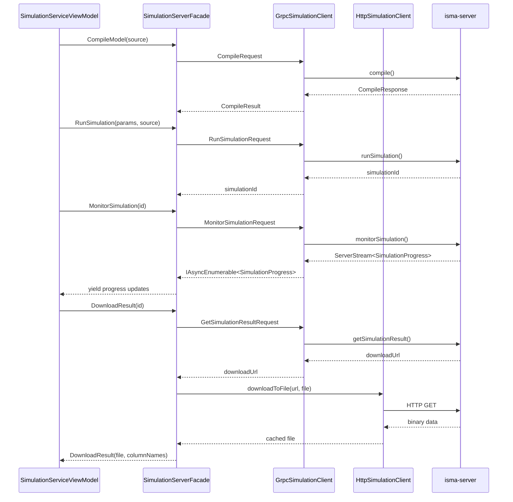

# External Services

## Purpose

The `ISMA.Infrastructure` assembly handles all communication with the ISMA server process. It manages the server's lifecycle (start/stop as a child process), provides gRPC clients over Unix Domain Sockets, an HTTP client over Unix sockets for result file downloads, and a facade that orchestrates these clients into high-level operations.

## Structure

```
ISMA.Infrastructure/
├── Server/
│   ├── SimulationServerFacade.cs        # Single facade for all server operations
│   ├── SimulationServerManager.cs       # Server process lifecycle (start/stop)
│   ├── GrpcSimulationClient.cs          # Simulation run/monitor/cancel via gRPC
│   ├── GrpcLismaCompilerClient.cs       # Compile/validate/highlight via gRPC
│   ├── HttpSimulationClient.cs          # HTTP result download
│   ├── BinaryFilePointProvider.cs       # Binary result file reader
│   ├── BinaryEquationIndexProvider.cs   # Equation metadata from column names
│   └── UnixSocketHandler.cs             # Unix domain socket transport
├── ChartViewer/
│   └── GrinProcessLauncher.cs           # Grin chart viewer process launcher
└── FileStorage/
    └── PreferencesProvider.cs           # JSON preferences persistence
```

## Server Lifecycle

### SimulationServerManager

**File:** `Server/SimulationServerManager.cs`

Manages the isma-server child process. The script path is resolved from `appsettings.json` (`Server:ScriptPath`) or environment variable `ISMA_SERVER_SCRIPT`.

```csharp
public class SimulationServerManager : IDisposable
{
    public SimulationServerManager(string scriptPath);
    public bool IsRunning { get; }
    public void Start();
    public void Stop();
    public void Dispose();
}
```

**Startup protocol:**

1. `ProcessBuilder(scriptPath).Start()` launches the server
2. Reads stdout line-by-line, skipping `WARNING:`, `SLF4J:`, blank, and log-prefixed lines
3. Expects the first non-skipped line to contain `GRPC_SOCKET=<path>`
4. Extracts gRPC socket path and HTTP socket path (line containing `HTTP_SOCKET=<path>`)
5. Returns socket paths for client initialization

A shutdown hook ensures the server process is destroyed on application exit.

### SimulationServerFacade

**File:** `Server/SimulationServerFacade.cs`

The facade orchestrates the three client connections. It's initialized lazily on first use:

```csharp
public class SimulationServerFacade : ISimulationServerFacade
{
    public Task<CompileResult> CompileModel(string source);
    public Task<ValidateResult> ValidateModel(string source);
    public Task<SyntaxTokenDto[]> HighlightSource(string source);
    public Task<string> RunSimulation(SimulationParameters parameters, string source);
    public IAsyncEnumerable<SimulationProgress> MonitorSimulation(string simulationId);
    public Task<DownloadResult> DownloadResult(string simulationId);
    public Task CancelSimulation(string simulationId);
    public Task<IList<string>> GetSimulationMethods();
    public void Shutdown();
}
```

| Method | Client | Description |
| --- | --- | --- |
| `CompileModel(source)` | `GrpcLismaCompilerClient` | Compiles LISMA source, returns model ID + errors |
| `ValidateModel(source)` | `GrpcLismaCompilerClient` | Validates LISMA source, returns errors |
| `HighlightSource(source)` | `GrpcLismaCompilerClient` | Tokenizes source for syntax highlighting |
| `RunSimulation(params, source)` | `GrpcSimulationClient` | Starts simulation, returns simulation ID |
| `MonitorSimulation(id)` | `GrpcSimulationClient` | Returns `IAsyncEnumerable<SimulationProgress>` |
| `DownloadResult(id)` | `GrpcSimulationClient` + `HttpSimulationClient` | Gets download URL, downloads to temp file |
| `CancelSimulation(id)` | `GrpcSimulationClient` | Cancels running simulation |
| `GetSimulationMethods()` | `GrpcSimulationClient` | Lists available integration methods |

**DTOs defined in the facade:**

```csharp
public record CompileResult(string ModelId, CompilationErrorDto[] Errors, string[] Warnings);
public record ValidateResult(CompilationErrorDto[] Errors, string[] Warnings);
public record DownloadResult(FileInfo File, IList<string> ColumnNames);
```

## gRPC Clients

### GrpcSimulationClient

**File:** `Server/GrpcSimulationClient.cs`

gRPC client using a custom `UnixSocketHandler` for Unix Domain Socket transport. Supports:
- `RunSimulation` — starts a simulation, returns simulation ID
- `MonitorSimulation` — server-streaming gRPC that yields `SimulationProgress` updates
- `CancelSimulation` — cancels a running simulation
- `GetSimulationMethods` — returns available integration method names

### GrpcLismaCompilerClient

**File:** `Server/GrpcLismaCompilerClient.cs`

Same Unix socket setup, communicates with the compiler service for:
- `CompileModel` — compiles LISMA source, returns model ID and compilation errors
- `ValidateModel` — validates LISMA source without compiling
- `HighlightSource` — returns syntax tokens for editor highlighting

### UnixSocketHandler

**File:** `Server/UnixSocketHandler.cs`

Custom `HttpMessageHandler` that routes HTTP requests to Unix domain socket paths. Enables `HttpClient` to communicate with the server over Unix sockets instead of TCP.

## HTTP Client

### HttpSimulationClient

**File:** `Server/HttpSimulationClient.cs`

`HttpClient` with `UnixSocketHandler` for downloading simulation result files over Unix Domain Sockets. Used exclusively by `DownloadResult()` — the gRPC client returns a download URL, and the HTTP client fetches the binary file.

## Data Providers

### BinaryFilePointProvider

**File:** `Server/BinaryFilePointProvider.cs`

Implements `ISimulationResultReader`. Reads binary simulation results and streams `SimulationPoint` data:

```csharp
public class BinaryFilePointProvider : ISimulationResultReader
{
    public SimulationPoint[] ReadPoints(string filePath);
    public SimulationMetadata ReadMetadata(string filePath);
}
```

### BinaryEquationIndexProvider

**File:** `Server/BinaryEquationIndexProvider.cs`

Implements `IEquationIndexProvider` by parsing column name prefixes:
- `DE_` — differential equation variables
- `AE_` — algebraic equation variables
- `f` — forcing functions

Derives equation counts and codes from the column metadata returned with the simulation result.

## Communication Flow: Simulation Run



## External Processes

### GrinProcessLauncher

**File:** `ChartViewer/GrinProcessLauncher.cs`

Launches the GRIN chart viewer as a child process. Resolves script path from `appsettings.json` (`Grin:ScriptPath`) or environment variable `ISMA_GRIN_SCRIPT`.

**Arguments:**
| Argument | Description |
|----------|-------------|
| `--result-file` | Path to the binary simulation result file |
| `--x-axis` | X-axis column name |
| `--charts` | Comma-separated Y-axis column names |

## Preferences Persistence

### PreferencesProvider

**File:** `FileStorage/PreferencesProvider.cs`

JSON file persistence using `System.Text.Json`. Stores `Preferences` (window geometry + last opened files) at `%APPDATA%/isma/preferences.json` (platform-specific path).

```csharp
public class PreferencesProvider : IPreferencesProvider
{
    public Preferences Load();
    public void Save(Preferences preferences);
}
```

**Thread safety:** Uses a `ReaderWriterLockSlim` to allow concurrent reads with exclusive writes.

## Error Handling

| Scenario | Behavior |
| --- | --- |
| Server script not found | `InvalidOperationException` — server path not configured |
| Server produces no output | `InvalidOperationException` — server started but produced no socket paths |
| HTTP socket not found in output | `InvalidOperationException` — HTTP socket path not found in server output |
| Empty download URL | `InvalidOperationException` — download URL is empty |
| gRPC failure | Propagated as `RpcException` from the gRPC client |
| Unix socket unavailable | `SocketException` at client creation time |
