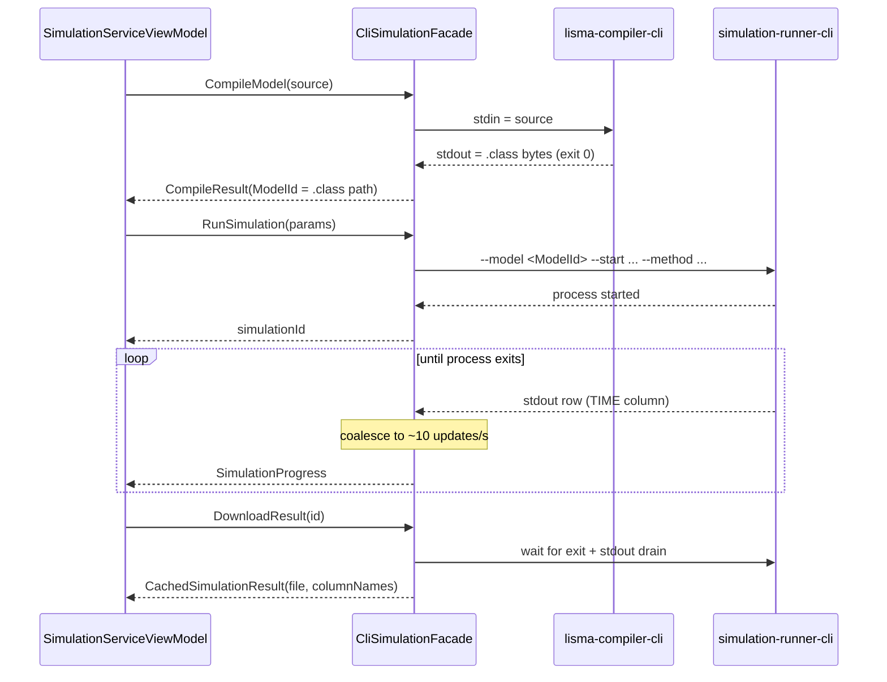

# External Services

## Purpose

The `ISMA.ExternalServices` assembly handles all communication with external ISMA tools. It launches and supervises the standalone CLI tools — the LISMA compiler CLI (`lisma-compiler-cli`) and the simulation runner CLI (`simulation-runner-cli`) — via a facade that maps them to the `ISimulationServerFacade` contract, and it drives the standalone `isma-lsp` language server process for syntax highlighting. There is no server process: compilation and simulation run as short-lived child processes.

## Structure

```
ISMA.ExternalServices/
├── Cli/
│   ├── CliToolLaunchers.cs              # Per-tool launchers (compiler, runner)
│   ├── CliLauncher.cs                   # Tool path resolution + non-blocking launch
│   ├── CliProcess.cs                    # Process handle: streams, exit code, SIGTERM/KILL
│   ├── CliStreams.cs                    # Stream helpers (read-all, write-all)
│   ├── CliToolException.cs              # Tool failure outside the documented contract
│   ├── CliWorkDir.cs                    # Shared %TEMP%/isma-ui artifact directory
│   ├── LismaCompilerCli.cs              # ILismaCompiler adapter (stdin → .class)
│   ├── SimulationRunnerCli.cs           # ISimulationRunner adapter (simulation runs)
│   ├── ActiveSimulation.cs              # IActiveSimulation: binary stream → result file + times
│   ├── CliSimulationFacade.cs           # ISimulationServerFacade over the tool ports
│   ├── BinaryFilePointProvider.cs       # Binary result file reader
│   └── BinaryEquationIndexProvider.cs   # Equation metadata from column names
├── Lsp/
│   ├── ILspTransport.cs                 # Byte-level LSP transport contract
│   ├── ProcessLspTransport.cs           # stdio transport with Content-Length framing
│   ├── LspProcessManager.cs             # isma-lsp process lifecycle
│   ├── LspClient.cs                     # JSON-RPC client (semantic tokens)
│   └── LspSyntaxHighlighter.cs          # ISyntaxHighlighter backed by LspClient
├── ChartViewer/
│   └── GrinProcessLauncher.cs           # Grin chart viewer process launcher
└── FileStorage/
    └── PreferencesProvider.cs           # JSON preferences persistence
```

## CLI Tool Lifecycle

The CLI integration is layered (onion): the domain defines the tool ports
(`ILismaCompiler`, `ISimulationRunner`, `IActiveSimulation` in
`ISMA.Domain/Contracts/`), and this assembly provides the CLI adapters. The
facade depends only on the ports, never on the concrete adapters.

### CliLauncher / CliProcess / CliToolLaunchers

**Files:** `Cli/CliLauncher.cs`, `Cli/CliProcess.cs`, `Cli/CliToolLaunchers.cs`

`CliToolLaunchers` holds one `CliLauncher` per tool (compiler, runner). Each
`CliLauncher` resolves the tool path from the environment variable
(`ISMA_COMPILER_CLI` / `ISMA_RUNNER_CLI`) or the `AppContext` config key
(`isma.compiler.cli` / `isma.runner.cli`, set from `appsettings.json`
`Compiler:ScriptPath` / `Runner:ScriptPath`), and launches it via
`StartAsync` — the blocking fork/exec runs on the thread pool, so launching is
safe from the UI thread. `CliProcess` wraps the child process: async access to
stdin/stdout/stderr, `WaitExitCodeAsync`, and `TerminateAsync` (SIGTERM on Unix
so the tool can run its shutdown hooks, hard kill after 2 s if it does not exit;
hard kill on Windows).

### LismaCompilerCli

**File:** `Cli/LismaCompilerCli.cs`

`ILismaCompiler` adapter for the LISMA compiler CLI.

**Contract:** LISMA source is written to stdin.

| Mode | Exit 0 | Exit 1 |
| --- | --- | --- |
| Compile (default) | stdout = compiled `.class` bytes | stdout = one `row:col:message` error line per error |
| `--validate` | no output | stdout = error lines |

`row`/`col` are 1-based/0-based ANTLR positions; `-1` means the error has no source position. Any other exit code is a tool failure and throws `CliToolException` (an `InvalidOperationException`) with the compiler stderr.

### SimulationRunnerCli

**File:** `Cli/SimulationRunnerCli.cs`

`ISimulationRunner` adapter for the simulation runner CLI.

**Arguments:**

```
--model <compiled.class>
--start <t0> --end <t1> --step <h> --method <name>
[--accuracy <a> --accuracy-enabled] [--stability-enabled]
[--gamma <g> --low-border <b>]
```

- `--list-methods` prints the bundled integration method names, one per line (exit 0).
- Exit 0 = success; exit 1 = failure with `simulation-runner: <message>` on stderr.
- The runner streams the result to stdout in the binary format: a metadata header (column count, then per-column name length + UTF-8 name), then one row per time step (big-endian doubles; the first column is TIME), each row flushed as it is produced.
- Cancellation is SIGTERM (the runner's shutdown hook aborts the run).

### ActiveSimulation

**File:** `Cli/ActiveSimulation.cs`

`IActiveSimulation` over a running runner process. A background task reads the
runner's stdout (the binary exchange format), tees the bytes into a result file
in `%TEMP%/isma-ui/` as they arrive, and publishes the TIME column of each row
to a channel. `Times` exposes the channel; `GetResultAsync` waits for the
process to exit and the stream to drain, then returns the result file + column
names (non-zero exit throws `CliToolException` with the runner stderr);
`CancelAsync` terminates the process.

### CliSimulationFacade

**File:** `Cli/CliSimulationFacade.cs`

Implements `ISimulationServerFacade` (domain contract) on top of the tool ports
(`ILismaCompiler`, `ISimulationRunner`):

| Method | Implementation |
| --- | --- |
| `CompileModel(source)` | Compiles via `ILismaCompiler`, stores the `.class` in `%TEMP%/isma-ui/`, returns `ModelId` = the file path |
| `ValidateModel(source)` | Validates via `ILismaCompiler` |
| `RunSimulation(params)` | Starts the runner (async — no blocking on the caller's thread), returns a local simulation ID |
| `MonitorSimulation(id)` | Consumes the runner's TIME stream, coalesced to at most one update per 100 ms or per 0.5 % of the time span (the runner emits one row per integration step; yielding every row would flood the UI dispatcher). The final time is always yielded. The coalescing loop runs off the UI synchronization context |
| `DownloadResult(id)` | Waits for the run to finish; non-zero exit throws with the runner stderr; otherwise returns the streamed result file path + column names |
| `CancelSimulation(id)` | Terminates the runner process (SIGTERM, hard kill fallback) |
| `GetSimulationMethods()` | Runs `--list-methods` |
| `Shutdown()` | Terminates running simulations and deletes stored model files |

Model IDs are local file paths; simulation IDs are local counters. Compiled models and result files live in `%TEMP%/isma-ui/`.

## Data Providers

### BinaryFilePointProvider

**File:** `Cli/BinaryFilePointProvider.cs`

Implements `ISimulationResultReader`. Reads binary simulation results and streams `SimulationPoint` data:

```csharp
public class BinaryFilePointProvider : ISimulationResultReader
{
    public SimulationPoint[] ReadPoints(string filePath);
    public SimulationMetadata ReadMetadata(string filePath);
}
```

The binary exchange format (big-endian, no header/magic): `short` column count, per column `short` name length + UTF-8 name, then rows of `columnCount` big-endian doubles until EOF. Column order: `TIME`, then `DE_*`, then `AE_*`, then `f*`.

### BinaryEquationIndexProvider

**File:** `Cli/BinaryEquationIndexProvider.cs`

Implements `IEquationIndexProvider` by parsing column name prefixes:
- `DE_` — differential equation variables
- `AE_` — algebraic equation variables
- `f` — forcing functions

Derives equation counts and codes from the column metadata of the simulation result.

## Communication Flow: Simulation Run


```mermaid
sequenceDiagram
    participant UI as SimulationServiceViewModel
    participant Facade as CliSimulationFacade
    participant Comp as lisma-compiler-cli
    participant Run as simulation-runner-cli

    UI->>Facade: CompileModel(source)
    Facade->>Comp: stdin = source
    Comp-->>Facade: stdout = .class bytes (exit 0)
    Facade-->>UI: CompileResult(ModelId = .class path)

    UI->>Facade: RunSimulation(params)
    Facade->>Run: --model <ModelId> --start ... --method ...
    Run-->>Facade: process started
    Facade-->>UI: simulationId

    loop until process exits
        Run-->>Facade: stdout row (TIME column)
        Note over Facade: coalesce to ~10 updates/s
        Facade-->>UI: SimulationProgress
    end

    UI->>Facade: DownloadResult(id)
    Facade->>Run: wait for exit + stdout drain
    Facade-->>UI: CachedSimulationResult(file, columnNames)
```

## External Processes

### GrinProcessLauncher

**File:** `ChartViewer/GrinProcessLauncher.cs`

Launches the GRIN chart viewer as a child process. Resolves script path from `appsettings.json` (`Grin:ScriptPath`) or environment variable `ISMA_GRIN_SCRIPT`.

**Arguments:**
| Argument | Description |
|----------|-------------|
| `--result-file` | Path to the binary simulation result file |
| `--x-axis` | X-axis column name |
| `--charts` | Comma-separated Y-axis column names |

## LSP Client

The `Lsp/` package drives the standalone `isma-lsp` language server for syntax highlighting.

### ILspTransport / ProcessLspTransport

**Files:** `Lsp/ILspTransport.cs`, `Lsp/ProcessLspTransport.cs`

`ILspTransport` is the byte-level transport contract: `Send(string json)`, `ReadNext(): string?` (blocking; null on end of stream), `Close()`. `ProcessLspTransport` backs it with a child process speaking LSP over stdio — stdout carries `Content-Length`-framed JSON-RPC 2.0 messages, stderr is drained to the logger.

### LspProcessManager

**File:** `Lsp/LspProcessManager.cs`

Manages the `isma-lsp` child process. The script path is resolved from `appsettings.json` (`Lsp:ScriptPath`) or environment variable `ISMA_LSP_SCRIPT`. `Start()` is idempotent — repeated calls return the same transport.

### LspClient

**File:** `Lsp/LspClient.cs`

Minimal LSP client. A reader thread dispatches responses to pending request tasks keyed by id. The `initialize`/`initialized` handshake is performed lazily on the first request.

| Member | Description |
| --- | --- |
| `SemanticTokensAsync(documentId, source)` | Opens the document on first call (`didOpen`), updates on subsequent calls (`didChange`), then requests `semanticTokens/full` and decodes the relative-format data into `LspToken(Line, StartChar, Length, Type)` records |
| `CloseDocument(documentId)` | Sends `textDocument/didClose` (idempotent) |
| `Shutdown()` | Best-effort: `shutdown` request, `exit` notification, transport close. Never throws |

Document URIs are `file:///isma/<documentId>.lisma`. Requests time out after 10 seconds.

### LspSyntaxHighlighter

**File:** `Lsp/LspSyntaxHighlighter.cs`

Implements `ISyntaxHighlighter` (domain contract) by delegating to `LspClient` and mapping LSP token types (`keyword`, `comment`, `number`) to `SyntaxTokenKind`.

## Preferences Persistence

### PreferencesProvider

**File:** `FileStorage/PreferencesProvider.cs`

JSON file persistence using `System.Text.Json`. Stores `Preferences` (window geometry + last opened files) at `%APPDATA%/isma/preferences.json` (platform-specific path).

```csharp
public class PreferencesProvider : IPreferencesProvider
{
    public Preferences Load();
    public void Save(Preferences preferences);
}
```

**Thread safety:** Uses a `ReaderWriterLockSlim` to allow concurrent reads with exclusive writes.

## Error Handling

| Scenario | Behavior |
| --- | --- |
| CLI script not found | `InvalidOperationException` — tool path not configured (`ISMA_COMPILER_CLI` / `ISMA_RUNNER_CLI` or appsettings keys) |
| Compiler exits with code > 1 | `CliToolException` (an `InvalidOperationException`) with the compiler stderr |
| Runner exits non-zero | `DownloadResult` throws `CliToolException` with the runner stderr (`simulation-runner: <message>`); the partial result file is deleted |
| Runner produces no output but exits 0 | an empty result file is returned |
| Unknown simulation ID | `InvalidOperationException` — simulation registry miss |
| Unknown script path (LSP/Grin) | LSP: `InvalidOperationException`; Grin: launch skipped with an error log |
