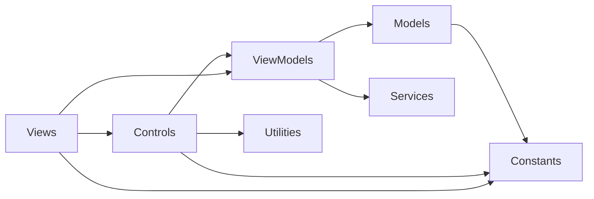

# Blueprint Editor Architecture

## Purpose

The `ISMA.BlueprintEditor` assembly is a standalone Avalonia module that provides a visual statechart (blueprint) editor. It allows users to create, edit, and visualize state machine diagrams with states, transitions, and self-loops. The module was rewritten from Kotlin/JavaFX to C#/Avalonia, following the same implementation logic and data flow.

The module has **zero project dependencies** — it references only Avalonia and CommunityToolkit.Mvvm. The host application (`ISMA.App`) integrates it through two seams: the `ITextEditorFactory` service (body editors) and the `GetBlueprintModel()`/`SetBlueprintModel()` model API (persistence).

## Module Structure

```
ISMA.BlueprintEditor/
├── ISMA.BlueprintEditor.csproj          # Project: Avalonia + CommunityToolkit.Mvvm only
├── Constants/
│   ├── BlueprintEditorConstants.cs      # Magic numbers: sizes, offsets, delays
│   └── StateNames.cs                    # Named constants: Main, Init
├── Models/
│   ├── BlueprintModel.cs                # Aggregate root (sealed record, ImmutableArray collections)
│   ├── BlueprintStateModel.cs           # State data: position, name, text
│   ├── BlueprintTransactionModel.cs     # Inter-state transition
│   └── BlueprintLoopTransactionModel.cs # Self-loop transition with text
├── ViewModels/
│   ├── EditorMode.cs                    # Mode state machine: Idle, AddTransition, RemoveState, RemoveTransition
│   ├── StateKind.cs                     # StateKind enum: Main, Init, User
│   ├── StateViewModel.cs                # State node: name, text, position, size, kind, edit mode
│   ├── TransactionViewModel.cs          # Transition: start/end names, predicate, alias, resolved states
│   ├── LoopTransactionViewModel.cs      # Loop: state name, predicate, alias, text, resolved state
│   ├── CanvasViewModel.cs               # Collections: states, transactions, loops + name monitor
│   ├── BlueprintEvent.cs                # VM→view events: OpenStateEditor, OpenLoopEditor
│   └── IsmaBlueprintViewModel.cs        # Master coordinator: mode, CRUD, serialization (to/from BlueprintModel)
├── Controls/
│   ├── StateBox.cs                      # Decorator: rounded box + name label + inline name edit TextBox
│   ├── TransactionArrow.cs              # Control + ICustomHitTest: line, arrowhead, label (DrawingContext)
│   ├── LoopTransactionArrow.cs          # Control + ICustomHitTest: circle, arrowhead, label (DrawingContext)
│   └── EditArrowPopOver.axaml(.cs)      # UserControl: alias + predicate text boxes
├── Converters/
│   └── StateKindToBrushConverter.cs     # StateKind → fill brush
├── Views/
│   ├── BlueprintCanvas.cs               # Canvas that measures to its children extent (+40 padding)
│   ├── CanvasView.axaml(.cs)            # ScrollViewer + 3-layer ItemsControl canvas
│   └── IsmaBlueprintEditor.axaml(.cs)   # Toolbar + TabControl: diagram tab + body editor tabs
└── Services/
    ├── ITextEditorFactory.cs            # Seam: ITextEditor CreateEditor()
    └── ITextEditor.cs                   # Seam: Node, Text, TextChanged, Dispose
```

## Dependency Graph



## Layer Responsibilities

| Layer | Responsibility |
|-------|----------------|
| **Views** | `IsmaBlueprintEditor` (toolbar, tabs, event routing, popover placement), `CanvasView` (3-layer canvas), `BlueprintCanvas` (content-extent measuring canvas) |
| **Controls** | `StateBox`, `TransactionArrow`, `LoopTransactionArrow`, `EditArrowPopOver` — custom visuals + interaction |
| **ViewModels** | Mode state machine, CRUD operations, name uniqueness, `BlueprintModel` (de)serialization |
| **Models** | Pure persistable data: `BlueprintModel` aggregate with `ImmutableArray` collections |
| **Utilities** | Pure logic: `ArrowGeometryCalculator` math, `ClickDisambiguator` timing, `NameChangingMonitor` |
| **Services** | Abstraction seams: `ITextEditorFactory` / `ITextEditor` |

## MVVM Pattern

All ViewModels use CommunityToolkit.Mvvm source-generated attributes (`[ObservableProperty]`, `[RelayCommand]`). Views bind with compiled bindings (`x:DataType`).

The one intentional code-behind is `IsmaBlueprintEditor` — a composite control whose logic (tab management, routed-event wiring, popover placement) mirrors the original Kotlin `IsmaBlueprintEditor` + `CanvasView` wiring. This is control logic, not view-model logic.

### State Machine (EditorMode)

The editor operates in one of four modes, implemented as a nested class hierarchy with a static idle singleton:

```csharp
public abstract class EditorMode
{
    public static EditorMode Idle { get; } = new IdleMode();

    public sealed class AddTransition : EditorMode
    {
        public List<StateViewModel> SelectedStates { get; } = new();
    }

    public sealed class RemoveState : EditorMode { }
    public sealed class RemoveTransition : EditorMode { }

    private sealed class IdleMode : EditorMode { }
}
```

**Mode transitions** (driven by toolbar buttons):

| From | Action | To |
|------|--------|----|
| Idle | "New transition" | AddTransition (fresh selection) |
| AddTransition | second state clicked / "Stop adding transaction" | Idle |
| Idle | "Remove state" | RemoveState |
| RemoveState | "Stop remove state" | Idle |
| Idle | "Remove transition" | RemoveTransition |
| RemoveTransition | "Stop remove transition" | Idle |

`IsmaBlueprintViewModel.OnEditorModeChanged` recomputes the toolbar button texts: "New transition" ↔ "Stop adding transaction", "Remove state" ↔ "Stop remove state", "Remove transition" ↔ "Stop remove transition".

## Data Flow

### State Creation

```
Toolbar "New state" → AddStateCommand → IsmaBlueprintViewModel.AddState(x=10, y=200)
  → ResetMode()
  → CanvasViewModel.CreateNextDefaultStateName() → "State N"
  → CanvasViewModel.CreateState(...) → new StateViewModel(name, text, x, y, w, h, User, isNameUnique)
  → CanvasViewModel.AddState(state) → nameMonitor.TryRegister(name); States.Add(state)
  → ObservableCollection change → ItemsControl realizes a StateBox (Margin bound to BoxMargin)
```

### Transition Creation (Two-Click Flow)

```
Toolbar "New transition" → EditorMode = AddTransition
StateBox single click (disambiguated) → routed SingleClickEvent
  → IsmaBlueprintEditor.OnStateSingleClick → ViewModel.HandleStateClick(state)
  → mode == AddTransition → RecordTransitionSource(state)
      first distinct user state  → AddTransition.SelectedStates.Add(state)
      second distinct user state → CanvasViewModel.AddTransaction(new TransactionViewModel(a, b)) → mode = Idle
      same state twice           → CanvasViewModel.AddLoopTransaction(new LoopTransactionViewModel(state)) → mode = Idle
  → ObservableCollection change → ItemsControl realizes a TransactionArrow / LoopTransactionArrow
```

Main and init states are never transition sources or targets (only `StateKind.User` states participate).

### State Dragging

```
StateBox.OnPointerPressed → pointer capture, record press position + initial X/Y
StateBox.OnPointerMoved   → beyond 2 px drag threshold:
  → disambiguator.OnDragged() (suppresses click handling)
  → state.X = initialX + (pressPos.X - currentPos.X)  (clamped to canvas)
  → state.Y = initialY + (pressPos.Y - currentPos.Y)
  → StateViewModel.OnXChanged/OnYChanged → OnPropertyChanged(BoxMargin)
  → ItemsControl re-lays-out the StateBox (Margin)
  → TransactionArrow/LoopTransactionArrow subscribe to state X/Y/size changes → Recompute() → InvalidateVisual()
```

### Inline Rename

```
StateBox single click (Idle mode) → ViewModel.HandleStateClick → state.StartEdit()
  → StateBox shows the overlay TextBox (EditMode bound), pre-filled with the name
  → Enter or focus loss → NameCommittedEvent → ViewModel.CommitNameEdit(state, newName)
      → state.Name = newName (gated by IsNameUnique; rejected values keep the old name)
  → Escape → edit cancelled, name unchanged
```

### Transaction Editing (Popover)

```
TransactionArrow arrowhead click → routed ArrowHeadClickedEvent
  → ViewModel.HandleArrowheadClick(tx) → true (in Idle mode)
  → IsmaBlueprintEditor.ShowPopover(tx, point):
      new EditArrowPopOver(tx) → Canvas.Left/Top centered on the click point, ZIndex = 3
      added to the diagram canvas; PointerExited removes it
  → AliasBox / PredicateBox two-way sync with TransactionViewModel.Alias / Predicate
```

### State/Loop Body Editor Tabs

```
StateBox double click → routed DoubleClickEvent → ViewModel.HandleStateDoubleClick(state)
  → FireEvent(BlueprintEvent.OpenStateEditor(state))   (observable Evt property)
IsmaBlueprintEditor watches Evt:
  → OpenStateEditorTab(state):
      EditorFactory.CreateEditor() → ITextEditor
      two-way sync: editor.TextChanged → state.Text; state.Text changed → editor.Text
      closable TabItem added to the TabControl (title follows renames; loop tabs get " (loop)" suffix)
  → OpenLoopEditorTab(loop, state): same pattern for loop.Text
```

Closing a tab unbinds and disposes the editor. `DisposeEditor()` closes the popover and all body tabs.

## Models

### BlueprintModel

The persistable aggregate root — a `sealed record` with `ImmutableArray` collections (use `.Length`, not `.Count`):

```csharp
public sealed record BlueprintModel(
    BlueprintStateModel Main,
    BlueprintStateModel Init,
    ImmutableArray<BlueprintStateModel> States,
    ImmutableArray<BlueprintTransactionModel> Transactions,
    ImmutableArray<BlueprintLoopTransactionModel> LoopTransactions)
{
    public static BlueprintModel Empty { get; } = new(
        new BlueprintStateModel(10, 10, StateNames.Main, ""),
        new BlueprintStateModel(10, 100, StateNames.Init, ""),
        ImmutableArray<BlueprintStateModel>.Empty,
        ImmutableArray<BlueprintTransactionModel>.Empty,
        ImmutableArray<BlueprintLoopTransactionModel>.Empty);
}
```

`States` holds user states only; Main and init are separate fields.

### Component Records

```csharp
public record BlueprintStateModel(double CanvasPositionX, double CanvasPositionY, string Name, string Text);
public record BlueprintTransactionModel(string StartStateName, string EndStateName, string Predicate, string Alias);
public record BlueprintLoopTransactionModel(string StateName, string Predicate, string Alias, string Text);
```

State identity is the **name** (no GUIDs) — matching the original editor and the `.iscm2` format.

### LismaTextModel

LISMA conversion output lives in `ISMA.Domain` (`LismaTextModel` with `FullText` + `ImmutableArray<CodeRegion> Regions`, `FragmentNameByLine(line)`). The blueprint→LISMA conversion itself is `ISMA.App/Services/Blueprint/LismaCodegen.cs`, invoked through `BlueprintProjectViewModel.ConvertToLisma()`.

## Controls

### StateBox

**Base class:** `Decorator` (content: `Border` with `CornerRadius` → `Grid` → `TextBlock` name label + `TextBox` name editor).

**Positioning:** owned by the bound `Margin` (`StateViewModel.BoxMargin` = `Thickness(X, Y, 0, 0)`); the control only owns its size and appearance.

**Routed events** (bubble, args carry the `StateViewModel`):

| Event | Args | Raised when |
|-------|------|-------------|
| `SingleClickEvent` | `StateBoxRoutedEventArgs(State)` | Disambiguated single click (200 ms delay) |
| `DoubleClickEvent` | `StateBoxRoutedEventArgs(State)` | Double click (immediate) |
| `NameCommittedEvent` | `NameCommittedRoutedEventArgs(State, NewName)` | Enter or focus loss in the name editor |

**Interaction:** pointer capture on press; drag threshold 2 px; drag updates `StateViewModel.X/Y` (clamped to the canvas via `FindDragSpace()`); the name editor commits on Enter/LostFocus and cancels on Escape.

### TransactionArrow

**Base class:** `Control` + `ICustomHitTest`. Pinned at canvas origin (0,0); everything is drawn in absolute canvas coordinates via `Render(DrawingContext)`:

- Line from start-state center to end-state center, offset perpendicularly by `ArrowLineOffset`
- Arrowhead triangle at the **line midpoint** (rotated to the line direction)
- Label (alias or predicate) offset from the midpoint

**Geometry:** `ArrowGeometryCalculator.Calculate(startX, startY, endX, endY, layoutX, layoutY, lineOffset, textXOffset, textYOffset)` — pure atan2-based math, ported verbatim from the original.

**Reactive:** subscribes to `PropertyChanged` on the transaction (alias/predicate) and on both states (X/Y/SquareWidth/SquareHeight) → `Recompute()` → `InvalidateMeasure()` + `InvalidateVisual()`.

**Hit testing:** `ICustomHitTest.HitTest(Point)` (local == canvas coordinates) — point-in-polygon or within 8 px of an arrowhead edge; within 6 px of the line segment. `OnPointerPressed` raises:

| Event | Args | Raised when |
|-------|------|-------------|
| `ArrowHeadClickedEvent` | `TransactionArrowRoutedEventArgs(Transaction, Point)` | Click on the arrowhead |
| `BodyClickedEvent` | `TransactionArrowRoutedEventArgs(Transaction, Point)` | Click on the line |

### LoopTransactionArrow

**Base class:** `Control` + `ICustomHitTest`. Custom-drawn in canvas coordinates relative to the state center:

- Circle (`LoopCircleRadius` = 40) centered at `(state.CenterX + 60, state.CenterY)`
- Arrowhead at `(state.CenterX + 100, state.CenterY)`
- Label at `(state.CenterX + 120, state.CenterY - 10)`

**Hit testing:** within the stroke tolerance of the circle, or near the arrowhead.

**Routed events** (args `LoopArrowRoutedEventArgs(Loop, Point)`):

| Event | Raised when |
|-------|-------------|
| `BodyClickedEvent` | Click on the circle body |
| `ArrowHeadClickedEvent` | Click on the arrowhead (single, disambiguated) |
| `ArrowHeadDoubleClickedEvent` | Double click on the arrowhead (opens the loop body editor) |

### EditArrowPopOver

**Base class:** `UserControl` (XAML: two labeled `TextBox`es — alias + predicate). The `Transaction` property two-way syncs the boxes with `TransactionViewModel.Alias`/`Predicate` (with change guards to avoid feedback loops).

**Placement:** created by `IsmaBlueprintEditor.ShowPopover`, positioned via `Canvas.SetLeft/SetTop` (centered on the click point), `ZIndex = 3`, removed on `PointerExited`.

## Utilities

### ArrowGeometryCalculator

Pure math (see `TransactionArrow` above). The `ArrowGeometry` record carries line endpoints, arrowhead translation/rotation, and label translation.

### ClickDisambiguator

Disambiguates single click, double click, and drag:

```csharp
public ClickDisambiguator(Action onSingleClick, Action onDoubleClick, int clickDelayMs = 200)
public void OnKeyPress()   // reset dragged flag (call on pointer press)
public void OnDragged()    // mark as drag → suppress click handling
public void OnClick(int clickCount)  // 1 = single (delayed), 2 = double (immediate)
public void Cancel()       // cancel any pending single click
```

Implementation: a lazily created `DispatcherTimer` (200 ms). A single click fires only if no second click arrives within the delay; a double click fires immediately. **Avalonia gotcha:** `DispatcherTimer` repeats by default (no `RepeatCount` property) — the tick handler must `Stop()` the timer first, or single-click actions re-fire every 200 ms forever.

### NameChangingMonitor

Tracks registered names and generates unique defaults:

- `TryRegister(name)` / `TryUnregister(name)` / `IsRegistered(name)` / `Reset()`
- `CreateNextDefaultName()` → `"{default} {N}"` (e.g. "State 1", "State 2"); the counter recovers from existing names, never decreases

## CanvasView

A `UserControl` that bridges the `CanvasViewModel` observable collections to the visual tree — **declaratively**, via three stacked `ItemsControl`s inside a `BlueprintCanvas` inside a `ScrollViewer`:

```xml
<ScrollViewer ...>
  <views:BlueprintCanvas x:Name="RootCanvas">
    <ItemsControl ItemsSource="{Binding States}" ZIndex="0">
      <ItemsControl.ItemsPanel>... <views:BlueprintCanvas /> ...</ItemsControl.ItemsPanel>
      <ItemsControl.ItemTemplate>
        <DataTemplate DataType="vm:StateViewModel">
          <controls:StateBox Margin="{Binding BoxMargin}" State="{Binding}"
                             Fill="{Binding Kind, Converter={StaticResource StateKindBrush}}" />
        </DataTemplate>
      </ItemsControl.ItemTemplate>
    </ItemsControl>
    <ItemsControl ItemsSource="{Binding Transactions}" ZIndex="1"> ... TransactionArrow ... </ItemsControl>
    <ItemsControl ItemsSource="{Binding LoopTransactions}" ZIndex="2"> ... LoopTransactionArrow ... </ItemsControl>
  </views:BlueprintCanvas>
</ScrollViewer>
```

- **Layering:** states (ZIndex 0) below transactions (1) below loops (2); the popover is added at ZIndex 3.
- **Positioning:** `StateBox` is positioned by `Margin` bound to `StateViewModel.BoxMargin` (the ItemsControl container sits at 0,0). `ItemsControl.ItemContainerTheme` is deliberately avoided — it misbehaves in Avalonia 12 for this use case.
- **Arrows** are pinned at the canvas origin and draw in absolute coordinates, so no per-arrow layout is needed; they recompute on state changes.
- **`BlueprintCanvas`** is a `Canvas` subclass that measures to the extent of its children plus 40 px padding, so the `ScrollViewer` scrolls over the full diagram. It maps `NaN` `Canvas.Left`/`Top` to 0 — **Avalonia gotcha:** unlike WPF, unset `Canvas.Left`/`Top` are `NaN`, not 0.

**Avalonia 12 hit-testing gotcha:** the composition target prunes subtrees whose transformed bounds are null/empty. A plain `Canvas` panel measures to (0,0) → zero layout bounds → its children become unhittable. That is why every layer panel is a `BlueprintCanvas` (non-zero extent), not a plain `Canvas`.

## IsmaBlueprintEditor

A `UserControl` (composite control — code-behind is intentional):

```
DockPanel
├── Toolbar (StackPanel, docked bottom): "New state", mode toggle buttons
└── TabControl
    ├── DiagramTab: CanvasView (DataContext = CanvasViewModel)
    └── dynamic body-editor tabs (state bodies, loop bodies)
```

**Public API:**

| Member | Purpose |
|--------|---------|
| `IsmaBlueprintEditor(ITextEditorFactory)` | Constructor; creates the `IsmaBlueprintViewModel` |
| `ViewModel` | The editor view model |
| `GetBlueprintModel()` | Current diagram as `BlueprintModel` |
| `SetBlueprintModel(BlueprintModel)` | Replace the diagram from a model |
| `DisposeEditor()` | Close the popover and all body editor tabs, dispose editors |
| `DiagramCanvas` | The `CanvasView` (exposes `DiagramCanvas` → the root `BlueprintCanvas`) |

**Event routing:** the constructor attaches `AddHandler` for all routed events on the diagram canvas (`StateBox.SingleClickEvent`, `StateBox.DoubleClickEvent`, `StateBox.NameCommittedEvent`, `TransactionArrow.ArrowHeadClickedEvent`, `TransactionArrow.BodyClickedEvent`, `LoopTransactionArrow.BodyClickedEvent`, `LoopTransactionArrow.ArrowHeadDoubleClickedEvent`) and forwards them to the view model.

**Body editor tabs:** opened via the observable `Evt` property (`BlueprintEvent.OpenStateEditor` / `OpenLoopEditor`); one tab per state/loop, two-way text sync, closable, titles follow renames.

**Toolbar visibility:** hidden while a body editor tab is selected, restored when the diagram tab is selected.

## Serialization

Persistence lives in the host: `ISMA.App/Services/Blueprint/BlueprintFileSerializer.cs` (`.iscm2` JSON, compatible with the original ISMA UI). `BlueprintProjectViewModel` wires it up:

- **Save:** `GetBlueprintModel()` → `BlueprintFileSerializer.ToJson(model)` → file
- **Open:** file → `BlueprintFileSerializer.FromJson(json)` → `SetBlueprintModel(model)`
- **`ToBlueprintModel`** (VM): Main/init/user states → `BlueprintStateModel(X, Y, Name, Text)`; transactions/loops by state name
- **`FromBlueprintModel`** (VM): `ClearAll()` → recreate Main (fixed height, protected) + init (protected) → user states → transactions (start/end resolved by name; missing references dropped) → loops

File extension routing (`ProjectService.ProjectTypeFromPath`): `.im2` → LISMA text, `.iscm2` → blueprint, `.im` → legacy (open reports an error), anything else → LISMA text.

## Constants

| Constant | Value | Purpose |
|----------|-------|---------|
| `DefaultStateWidth` | 110.0 | Default state box width |
| `DefaultStateHeight` | 65.0 | Default state box height |
| `FixedStateHeight` | 60.0 | Fixed height for Main/Init states |
| `CornerRadius` | 20.0 | Rectangle corner radius |
| `StateNameFontSize` | 16.0 | State name font size |
| `StateInset` | 10.0 | Inner padding for the state label |
| `ArrowLineOffset` | 10.0 | Perpendicular offset for arrow lines |
| `ArrowTextXOffset` | 75.0 | Horizontal label offset from line midpoint |
| `ArrowTextYOffset` | 50.0 | Vertical label offset from line midpoint |
| `ArrowLineStroke` | 3.0 | Arrow line thickness |
| `ArrowheadStroke` | 3.0 | Arrowhead polygon stroke |
| `ArrowheadWidth` | 7.0 | Arrowhead polygon half-width |
| `ArrowLabelFontSize` | 16.0 | Arrow label font size |
| `ArrowLabelFieldWidth` | 120.0 | Arrow label field width (measure extent) |
| `LoopCircleRadius` | 40.0 | Self-loop circle radius |
| `LoopCircleCenterX` | 60.0 | Self-loop circle center X offset from state center |
| `LoopArrowheadX` | 100.0 | Self-loop arrowhead X position |
| `LoopLabelX` | 120.0 | Self-loop label X position |
| `LoopLabelYOffset` | -10.0 | Self-loop label Y offset |
| `ClickDelayMs` | 200 | Single/double click disambiguation delay (ms) |
| `PopoverMinWidth` | 300.0 | PopOver minimum width |
| `PopoverPadding` | 10.0 | PopOver padding |
| `PopoverCornerRadius` | 5.0 | PopOver corner radius |
| `PopoverShadowRadius` | 20.0 | PopOver drop shadow radius |

Hit tolerances (control-local): arrowhead 8 px, arrow body 6 px.

## Integration Points

### ITextEditorFactory / ITextEditor

The seam that keeps the module decoupled from the concrete text editor:

```csharp
public interface ITextEditorFactory
{
    ITextEditor CreateEditor();
}

public interface ITextEditor : IDisposable
{
    Control Node { get; }
    string Text { get; set; }
    event EventHandler? TextChanged;
}
```

`ISMA.App` provides the implementation (`BlueprintTextEditorFactory` wrapping `ISMA.TextEditor.IsmaTextEditor` with LISMA syntax highlighting). This is a distinct interface from the app-level `ISMA.Domain.Contracts.ITextEditorFactory` used for main-window text tabs.

### Host Wiring

`ISMA.App/ViewModels/BlueprintProjectViewModel.cs` owns an `IsmaBlueprintEditor` instance, exposes it to the tab content (`ContentControl`), and routes save/open through the serializer. `ServiceCollectionExtensions.cs` registers the factory.

## Key Differences from the JavaFX Original

| Aspect | JavaFX Original | Avalonia Port |
|--------|----------------|---------------|
| UI framework | JavaFX | Avalonia 12 |
| MVVM | JavaFX Properties (SimpleStringProperty, etc.) | CommunityToolkit.Mvvm `[ObservableProperty]` |
| Collections | JavaFX `ObservableList` | `ObservableCollection<T>` (canvas), `ImmutableArray<T>` (persisted model) |
| Drawing | JavaFX `Line`/`Polygon`/`Circle` controls | `DrawingContext` in `Render` (arrows); `Border`/`TextBlock`/`TextBox` (state boxes) |
| Canvas node sync | Manual `Pane` children management | Declarative `ItemsControl` + `DataTemplate` + `Margin` binding |
| State positioning | `Canvas.setTranslateX/Y` | `Margin` bound to `BoxMargin` (X/Y) |
| Inline editing | `TextArea` overlay | `TextBox` overlay inside the StateBox |
| PopOver | JavaFX `PopOver` | `UserControl` added to the canvas, `ZIndex` 3, removed on `PointerExited` |
| Click disambiguation | JavaFX `Timeline` (200 ms) | `DispatcherTimer` (200 ms, one-shot via `Stop()`) |
| Drag | JavaFX `DragEvent` | `PointerPressed`/`Moved`/`Released` + pointer capture |
| Name validation | JavaFX binding | Gated `StateViewModel.Name` setter + `NameChangingMonitor` |
| Mode state machine | Kotlin sealed class | C# nested class hierarchy + static `Idle` |
| Hit testing | JavaFX shape hit areas | `ICustomHitTest` + `OnPointerPressed` geometry checks |
| DI | Not used | `ITextEditorFactory` seam (injected at construction) |

## Build

```bash
dotnet build src/ISMA.BlueprintEditor/ISMA.BlueprintEditor.csproj
```

## Dependencies

| Package | Version | Purpose |
|---------|---------|---------|
| `Avalonia` | 12.x | UI framework |
| `CommunityToolkit.Mvvm` | 8.4.2 | MVVM source generation |

(versions pinned centrally in `Directory.Packages.props`)
