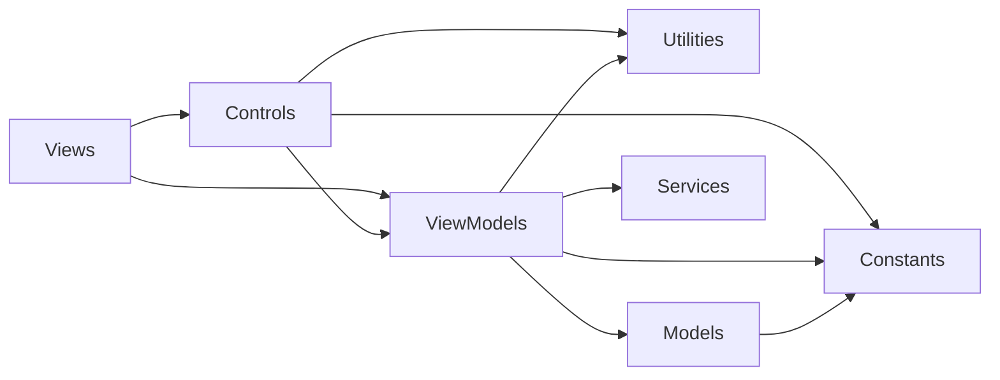
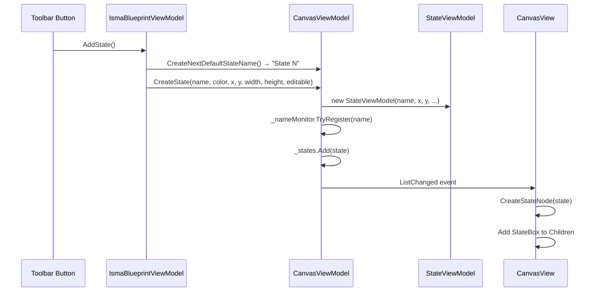
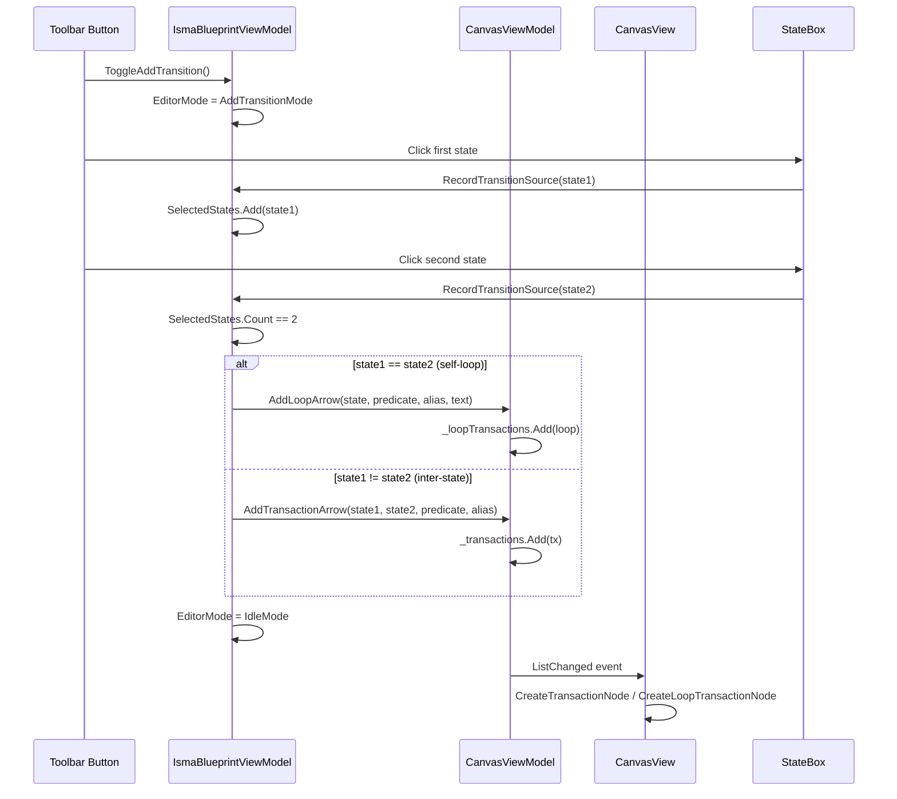
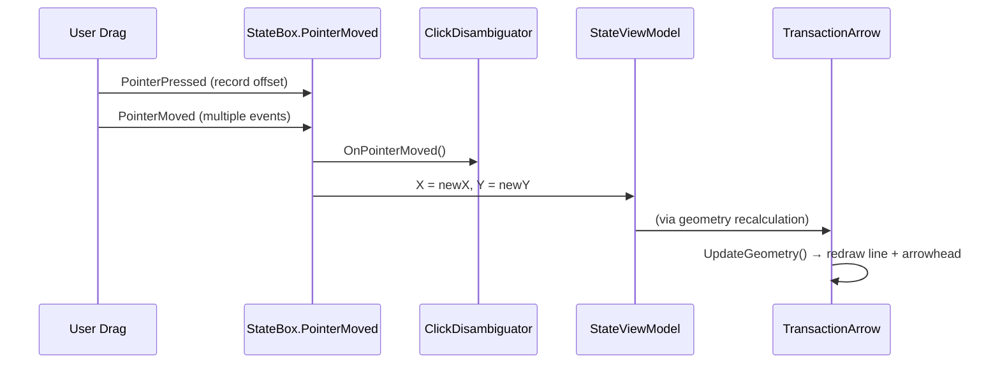
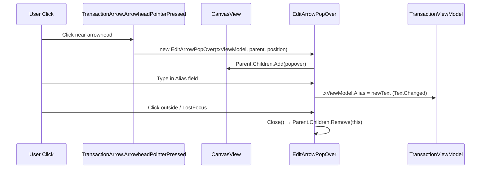

# Blueprint Editor Architecture

## Purpose

The `ISMA.BlueprintEditor` assembly is a standalone Avalonia module that provides a visual statechart (blueprint) editor. It allows users to create, edit, and visualize state machine diagrams with states, transitions, and self-loops. The module was rewritten from Kotlin/JavaFX to C#/Avalonia, following the same implementation logic and data flow.

## Module Structure

```
ISMA.BlueprintEditor/
├── ISMA.BlueprintEditor.csproj          # Project: Avalonia + CommunityToolkit.Mvvm
├── Constants/
│   ├── BlueprintEditorConstants.cs      # Magic numbers: sizes, offsets, delays
│   └── StateNames.cs                    # Named constants: Main, Init
├── Models/
│   ├── BlueprintStateModel.cs           # State data: position, name, text
│   ├── BlueprintTransactionModel.cs     # Inter-state transition
│   ├── BlueprintLoopTransactionModel.cs # Self-loop transition with text
│   ├── BlueprintModel.cs                # Aggregate root + ToLismaText()
│   └── LismaTextModel.cs               # Generated LISMA text with CodeRegion tracking
├── Utilities/
│   ├── ArrowGeometry.cs                 # atan2-based arrow line/arrowhead math
│   ├── ClickDisambiguator.cs            # Single-click vs double-click vs drag detection
│   └── NameChangingMonitor.cs           # Unique name tracking with auto-increment
├── ViewModels/
│   ├── EditorMode.cs                    # Sealed state machine: Idle, AddTransition, RemoveState, RemoveTransition
│   ├── StateViewModel.cs                # State node: name, text, position, size, color, edit state
│   ├── TransactionViewModel.cs          # Transition: start/end names, predicate, alias, selected
│   ├── LoopTransactionViewModel.cs      # Loop: state name, predicate, alias, text
│   ├── CanvasViewModel.cs               # Collections: states, transactions, loop transactions + name registry
│   └── IsmaBlueprintViewModel.cs        # Master coordinator: mode, CRUD, serialization (to/from BlueprintModel)
├── Controls/
│   ├── StateBox.cs                      # Colored rounded rectangle + inline name editing via overlay TextBox
│   ├── TransactionArrow.cs              # Line + arrowhead polygon + label (rendered via DrawingContext)
│   ├── LoopTransactionArrow.cs          # Circle + arrowhead polygon + label (rendered via DrawingContext)
│   └── EditArrowPopOver.cs              # Floating dialog: alias + predicate TextField
├── Views/
│   ├── CanvasView.axaml.cs              # Syncs CanvasViewModel collections to UI nodes
│   └── IsmaBlueprintEditor.axaml.cs     # Root container: hosts CanvasView
└── Services/
    └── ITextEditorFactory.cs            # Interface for text editor abstraction (DI point)
```

## Dependency Graph



The module is self-contained. It depends only on Avalonia and CommunityToolkit.Mvvm. The `ITextEditorFactory` service interface is a DI injection point — the implementation is provided at integration time.

## Architecture

### Layered Design

| Layer | Assembly | Responsibility |
|-------|----------|----------------|
| **Views** | `ISMA.BlueprintEditor` | Avalonia UI composition, canvas node synchronization |
| **Controls** | `ISMA.BlueprintEditor` | Custom visual elements: StateBox, TransactionArrow, LoopTransactionArrow, EditArrowPopOver |
| **ViewModels** | `ISMA.BlueprintEditor` | MVVM business logic: state machine, CRUD operations, serialization |
| **Models** | `ISMA.BlueprintEditor` | Pure data: BlueprintModel, BlueprintStateModel, BlueprintTransactionModel, BlueprintLoopTransactionModel, LismaTextModel |
| **Utilities** | `ISMA.BlueprintEditor` | Pure logic: ArrowGeometry math, ClickDisambiguator timing, NameChangingMonitor |
| **Services** | `ISMA.BlueprintEditor` | Abstraction interfaces: ITextEditorFactory |

### MVVM Pattern

All ViewModels use CommunityToolkit.Mvvm source-generated attributes:
- `[ObservableProperty]` — property change notifications
- `[NotifyPropertyChangedFor]` — computed property dependencies
- `[RelayCommand]` — command implementations (used in integration layer)

```csharp
public partial class StateViewModel : ObservableObject
{
    [ObservableProperty] private string _name;
    [ObservableProperty] private string _text;
    [ObservableProperty] private double _x;
    [ObservableProperty] private double _y;

    partial void OnNameChanging(string? oldValue, string newValue)
    {
        if (IsNameUnique != null && !IsNameUnique(newValue))
            _name = oldValue ?? _name;
    }
}
```

### State Machine (EditorMode)

The editor operates in one of four modes, implemented as a sealed class hierarchy:

```csharp
public abstract class EditorMode { }
public sealed class IdleMode : EditorMode { }
public sealed class AddTransitionMode : EditorMode { public List<StateViewModel> SelectedStates; }
public sealed class RemoveStateMode : EditorMode { }
public sealed class RemoveTransitionMode : EditorMode { }
```

**Mode transitions:**
- Idle → AddTransition (click "New transition")
- AddTransition → Idle (select two states, or click "Stop adding transaction")
- Idle → RemoveState (click "Remove state")
- RemoveState → Idle (click "Stop remove state")
- Idle → RemoveTransition (click "Remove transition")
- RemoveTransition → Idle (click "Stop remove transition")

## Data Flow

### State Creation



### Transition Creation (Two-Click Flow)



### State Dragging



### Transaction Editing (Popover)



## Models

### BlueprintModel

The aggregate root representing a complete statechart:

```csharp
public class BlueprintModel
{
    public BlueprintStateModel Main { get; }
    public BlueprintStateModel Init { get; }
    public IReadOnlyCollection<BlueprintStateModel> States { get; }
    public IReadOnlyCollection<BlueprintTransactionModel> Transactions { get; }
    public IReadOnlyCollection<BlueprintLoopTransactionModel> LoopTransactions { get; }

    public static BlueprintModel Empty { get; }
    public LismaTextModel ToLismaText() { ... }
}
```

**`ToLismaText()` algorithm:**
1. Append Main state text as first fragment
2. Group transactions by (endStateName, predicate) → each group becomes a `state <name> { <text> } from <sources>;` block
3. For each loop transaction, create two pseudo-states:
   - `state <name>_pseudo_1 (<predicate>) { <text> } from <name>;`
   - `state <name> (1 > 0) { <text> } from <name>_pseudo_1;`

### BlueprintStateModel

```csharp
public record BlueprintStateModel(double CanvasPositionX, double CanvasPositionY, string Name, string Text);
```

### BlueprintTransactionModel

```csharp
public class BlueprintTransactionModel(string StartStateName, string EndStateName, string Predicate, string Alias = "")
```

### BlueprintLoopTransactionModel

```csharp
public class BlueprintLoopTransactionModel(string StateName, string Predicate, string Alias = "", string Text = "")
```

### LismaTextModel

```csharp
public record LismaTextModel(string FullText, List<CodeRegion> Regions);
public record CodeRegion(string Name, int StartLine, int EndLine);
```

`FragmentNameByIndex(int lineNumber)` maps a line number back to its state name.

## Controls

### StateBox

**Base class:** `Panel`

**Visual elements:**
- Rounded rectangle background (rendered via `Path` with `StreamGeometry`)
- State name text (rendered via `FormattedText` in `Render()`)
- Inline name editing: overlay `TextBox` added to parent `Canvas` when entering edit mode

**Key behaviors:**
- Double-click / single-click (via `ClickDisambiguator`) enters edit mode
- `TextBox` commits name on Enter / LostFocus, cancels on Escape
- Drag: records offset on `PointerPressed`, updates `StateViewModel.X/Y` on `PointerMoved`

### TransactionArrow

**Base class:** `Control`

**Rendering:** `Render(DrawingContext)` draws:
- Line from start state center to end state center (with perpendicular offset)
- Arrowhead polygon at line end (rotated to match line direction)
- Label text at computed offset position

**Geometry:** Uses `ArrowGeometry.CalculateArrowGeometry()` — atan2-based perpendicular offset calculation.

### LoopTransactionArrow

**Base class:** `Control`

**Rendering:** `Render(DrawingContext)` draws:
- Circle (ellipse with equal radii) to the right of the state
- Arrowhead at top of circle (downward-pointing triangle)
- Label above the circle

### EditArrowPopOver

**Base class:** `Panel`

**Positioning:** Placed at click position via `Canvas.Left` / `Canvas.Top` attached properties.

**Contents:**
- `TextBlock` "Alias (optional)" + `TextBox` bound to `TransactionViewModel.Alias`
- `TextBlock` "Predicate" + `TextBox` bound to `TransactionViewModel.Predicate`
- Closes on outside click or focus loss

## Utilities

### ArrowGeometry

Pure math for computing arrow line, arrowhead, and label positions.

**`CalculateArrowGeometry(startX, startY, endX, endY, layoutOffset, textXOffset, textYOffset)`:**
1. Compute center: `(startX + endX) / 2, (startY + endY) / 2`
2. Compute direction: `dx = startX - endX, dy = startY - endY`
3. Compute angle: `atan2(dx, dy) + PI / 2` (Y-down coordinate system)
4. Apply perpendicular offset: `offsetX = layoutOffset * sin(angle), offsetY = layoutOffset * cos(angle)`
5. Compute line endpoints: center ± offset
6. Compute arrowhead position: line end ± offset
7. Compute label position: center + text offsets rotated by angle

### ClickDisambiguator

State machine distinguishing single-click, double-click, and drag:

| Event | Behavior |
|-------|----------|
| `PointerPressed` | Record timestamp; if within 200ms of last click → double-click handler |
| `PointerReleased` | If no drag and within delay window → single-click handler |
| `PointerMoved` | Set `_isDragged = true`, cancel pending single-click |
| `KeyPressed` | Reset `_isDragged = false` |

### NameChangingMonitor

Tracks registered state names and generates unique default names:

- `TryRegister(name)` — returns false if name exists, otherwise adds and updates counter
- `TryUnregister(name)` — removes name from registry
- `CreateNextDefaultName()` — returns `"{default} {N}"` where N is next available number
- Counter parses existing names matching `"{default} (\d+)"` pattern, never decreases

## CanvasView

**Role:** Bridges `CanvasViewModel` observable collections to UI nodes.

**Maps:**
- `Dictionary<StateViewModel, StateBox> _stateNodeMap`
- `Dictionary<TransactionViewModel, TransactionArrow> _transactionNodeMap`
- `Dictionary<LoopTransactionViewModel, LoopTransactionArrow> _loopTransactionNodeMap`

**Sync methods:**
- `SyncStates()` — adds new StateBox for new states, removes StateBox for removed states
- `SyncTransactions()` — same pattern for TransactionArrow
- `SyncLoopTransactions()` — same pattern for LoopTransactionArrow

**Node creation:**
- `CreateStateNode(state)` — creates StateBox, sets Canvas.Left/Top, wires OnClick callback
- `CreateTransactionNode(tx)` — creates TransactionArrow, calls `UpdateArrowPositions(start, end)`
- `CreateLoopTransactionNode(loop)` — creates LoopTransactionArrow, calls `UpdateLoopPosition(state)`

## IsmaBlueprintViewModel

The master coordinator. Key methods:

| Method | Description |
|--------|-------------|
| `ResetMode()` | Returns to IdleMode |
| `ToggleAddTransition()` | Toggles Idle ↔ AddTransition |
| `ToggleRemoveState()` | Toggles Idle ↔ RemoveState |
| `ToggleRemoveTransition()` | Toggles Idle ↔ RemoveTransition |
| `AddState()` | Creates new state with auto-generated name |
| `RemoveState(state)` | Removes state (protects Main/Init) |
| `RecordTransitionSource(state)` | Two-click transition creation flow |
| `AddTransactionArrow(start, end, predicate, alias)` | Creates inter-state transition |
| `AddLoopArrow(state, predicate, alias, text)` | Creates self-loop transition |
| `ToBlueprintModel()` | Serializes all ViewModels to BlueprintModel |
| `FromBlueprintModel(model)` | Restores from BlueprintModel (clears canvas, recreates) |
| `ComputeArrowDisplayText(predicate, alias)` | Returns alias if non-blank, otherwise predicate |

## CanvasViewModel

Manages collections of canvas items:

| Property | Type | Description |
|----------|------|-------------|
| `States` | `IReadOnlyList<StateViewModel>` | All state nodes |
| `Transactions` | `IReadOnlyList<TransactionViewModel>` | Inter-state transitions |
| `LoopTransactions` | `IReadOnlyList<LoopTransactionViewModel>` | Self-loop transitions |

**Key methods:**
- `AddState(state)` — registers name, adds to collection
- `RemoveState(state)` — **cascading removal**: removes state + all transactions referencing it (as start or end) + all loop transactions referencing it
- `RemoveTransaction(tx)` / `RemoveLoopTransaction(loop)` — remove from respective lists
- `ClearAll()` — clears collections + name monitor
- `TryRegisterStateName(name)` / `TryUnregisterStateName(name)` — name uniqueness tracking
- `CreateNextDefaultStateName()` — generates "State 1", "State 2", etc.

## CanvasView Node Synchronization

CanvasView watches the `CanvasViewModel` collections and syncs UI nodes:

```
CanvasViewModel.States changed (add/remove)
    → CanvasView.SyncStates()
    → For each new state: CreateStateNode(state) → add to Children
    → For each removed state: remove from Children, call Cleanup()

CanvasViewModel.Transactions changed (add/remove)
    → CanvasView.SyncTransactions()
    → For each new transaction: CreateTransactionNode(tx) → add to Children
    → For each removed transaction: remove from Children, call Cleanup()

CanvasViewModel.LoopTransactions changed (add/remove)
    → CanvasView.SyncLoopTransactions()
    → For each new loop: CreateLoopTransactionNode(loop) → add to Children
    → For each removed loop: remove from Children, call Cleanup()
```

## Serialization

### ToBlueprintModel

Converts ViewModels to persisted models:

```
MainState → BlueprintStateModel(X, Y, Name, Text)
InitState → BlueprintStateModel(X, Y, Name, Text)
Each additional State → BlueprintStateModel(X, Y, Name, Text)
Each Transaction → BlueprintTransactionModel(StartStateName, EndStateName, Predicate, Alias)
Each LoopTransaction → BlueprintLoopTransactionModel(StateName, Predicate, Alias, Text)
```

### FromBlueprintModel

Restores ViewModels from persisted models:

```
CanvasViewModel.ClearAll()
Recreate MainState (editable=true, LightGreen, fixed height)
Recreate InitState (editable=false, LightBlue, fixed height)
Create stateMap: name → StateViewModel
Load additional states from model.States
Load transactions from model.Transactions (lookup start/end states from stateMap)
Load loop transactions from model.LoopTransactions (lookup state from stateMap)
```

## Constants

| Constant | Value | Purpose |
|----------|-------|---------|
| `DefaultStateWidth` | 110.0 | Default state box width |
| `DefaultStateHeight` | 65.0 | Default state box height |
| `FixedStateHeight` | 60.0 | Fixed height for Main/Init states |
| `CornerRadius` | 20.0 | Rectangle corner radius |
| `StateNameFontSize` | 16.0 | State name font size |
| `StateInset` | 10.0 | Inner padding for state label |
| `ArrowLineOffset` | 10.0 | Perpendicular offset for arrow lines |
| `ArrowTextXOffset` | 75.0 | Horizontal label offset from line center |
| `ArrowTextYOffset` | 50.0 | Vertical label offset from line center |
| `ArrowLineStroke` | 3.0 | Arrow line thickness |
| `ArrowheadStroke` | 3.0 | Arrowhead polygon stroke |
| `ArrowheadWidth` | 7.0 | Arrowhead polygon half-width |
| `ArrowLabelFontSize` | 16.0 | Arrow label font size |
| `LoopCircleRadius` | 40.0 | Self-loop circle radius |
| `LoopCircleCenterX` | 60.0 | Self-loop circle center X offset from state |
| `LoopArrowheadX` | 100.0 | Self-loop arrowhead X position |
| `LoopLabelX` | 120.0 | Self-loop label X position |
| `LoopLabelYOffset` | -10.0 | Self-loop label Y offset |
| `ClickDelayMs` | 200 | Click/disambiguation delay in milliseconds |
| `PopoverMinWidth` | 300.0 | PopOver minimum width |
| `PopoverPadding` | 10.0 | PopOver padding |
| `PopoverCornerRadius` | 5.0 | PopOver corner radius |
| `PopoverShadowRadius` | 20.0 | PopOver drop shadow radius |

## Key Differences from JavaFX Original

| Aspect | JavaFX Original | Avalonia Port |
|--------|----------------|---------------|
| UI Framework | JavaFX | AvaloniaUI |
| MVVM | JavaFX Properties (SimpleStringProperty, etc.) | CommunityToolkit.Mvvm ([ObservableProperty]) |
| Collections | JavaFX ObservableList | .NET IReadOnlyList<T> / List<T> |
| Drawing | JavaFX Line, Polygon, Circle controls | Avalonia DrawingContext (Render method) |
| Inline Editing | TextArea overlay | TextBox overlay added to parent Canvas |
| PopOver | JavaFX PopOver | Panel added to parent Canvas with Canvas.Left/Top |
| Click Disambiguation | JavaFX Timeline (200ms delay) | Timestamp comparison (DateTimeOffset) |
| Drag | DragEvent | PointerPressed/Moved/Released |
| Name Validation | JavaFX binding | partial void OnNameChanging() callback |
| State Machine | sealed class (Kotlin) | sealed class (C#) |
| DI | Not used | ITextEditorFactory interface (injected at integration) |

## Integration Points

### ITextEditorFactory

The `ITextEditorFactory` service interface is a DI injection point for text editor integration:

```csharp
public interface ITextEditorFactory
{
    Control CreateTextEditor(string text, Action<string> onTextChanged);
    void DisposeInstance(Control node);
}
```

This interface is called when a user double-clicks a state to edit its LISMA text. The implementation is provided by the integrating assembly (e.g., `ISMA.App`).

### CanvasView ViewModel Binding

CanvasView receives its data via the `CanvasViewModel` property:

```xml
<local:CanvasView CanvasViewModel="{Binding CanvasViewModel}" />
```

The `IsmaBlueprintEditor` view creates the `CanvasViewModel` internally and passes it to CanvasView.

## Build

```bash
dotnet build src/ISMA.BlueprintEditor/ISMA.BlueprintEditor.csproj
```

## Dependencies

| Package | Version | Purpose |
|---------|---------|---------|
| `Avalonia` | 12.0.5 | UI framework |
| `Avalonia.Themes.Fluent` | 12.0.5 | Fluent theme |
| `Avalonia.Desktop` | 12.0.5 | Desktop platform support |
| `Avalonia.Fonts.Inter` | 12.0.5 | Inter font family |
| `CommunityToolkit.Mvvm` | 8.4.2 | MVVM source generation |
